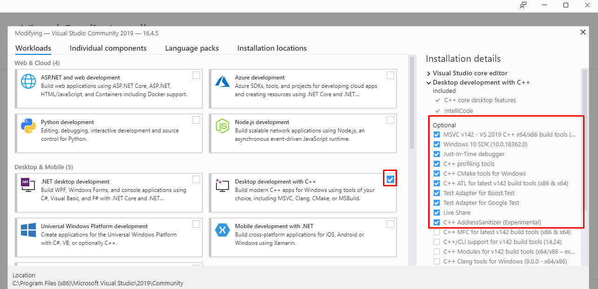

# RUST fundamentals

## intalation windows

- [https://www.rust-lang.org/tools/install](rust installation)
- You need add environments path `C:\%USERPROFILE%\.cargo\bin`
- [https://visualstudio.microsoft.com/downloads/#build-tools-for-visual-studio-2019](https://visualstudio.microsoft.com/downloads/#build-tools-for-visual-studio-2019) download Powerful IDE, free for students,... 
install it like this

## packages

- [page with rust packages](https://crates.io/keywords/parser)

## documentation

- [doc](https://doc.rust-lang.org/book/)

## runners

- `cargo build` - build your project
- `cargon run` - build and run rust project

## cookbook

`std` - is standard library which contains io library 
`io` - is lib for get input output scope

